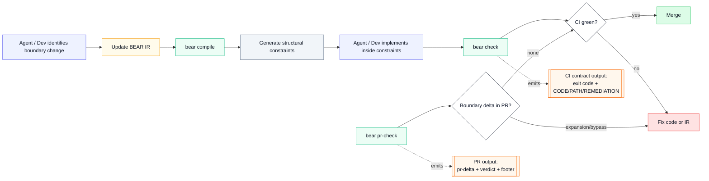

# BEAR

Block Enforceable Architectural Representation

<p align="center">
  
</p>

Agents can generate large amounts of code very quickly.
The dangerous changes are often structural: new dependencies, widened boundaries, and new authority surfaces.

BEAR is a deterministic governance CLI that constrains agents during development and emits stable governance signals in PRs and CI.

Demo repo: [bear-account-demo](https://github.com/rore/bear-account-demo)

## How BEAR Works

1. The agent declares boundary authority in a small YAML IR contract (BEAR IR).
2. `bear compile` generates deterministic structural constraints — typed wrappers, port interfaces, and manifests.
3. The agent implements code inside those constraints instead of inventing the boundary shape ad hoc.
4. `bear check` catches drift, boundary bypasses, and undeclared reach while the agent is still working.
5. `bear pr-check` surfaces boundary authority expansion in PRs and CI for human review.


<p><sub>Figure: the BEAR workflow (compile → check → pr-check) and the outputs CI should consume.<br/>Legend: yellow = IR you edit, green = BEAR commands, orange = what automation parses.</sub></p>

## Example Governance Signal

```text
BEAR Decision: REVIEW REQUIRED
MODE=observe DECISION=review-required BASE=<target-base>

CHECK exit=0 code=- classes=[CI_NO_STRUCTURAL_CHANGE]
PR-CHECK exit=5 code=BOUNDARY_EXPANSION classes=[CI_BOUNDARY_EXPANSION]
```

## What You Get

- Boundary authority expansion becomes explicit and machine-parseable in PRs.
- Generated constraints cannot drift silently.
- Every non-zero failure is actionable: `CODE`, `PATH`, `REMEDIATION`.
- Agents get immediate deterministic feedback; humans review governance signals.

<p align="center">
  
</p>

## Scope

BEAR is:
- a deterministic governance CLI for backend boundaries
- part of the agent working loop for immediate corrective feedback
- a CI-friendly signal producer for PR and automation review

BEAR is not:
- a business-rules engine or domain correctness verifier
- a runtime sandbox or IAM framework
- an agent orchestrator or workflow engine

## Supported Targets

- JVM/Java target in Preview.
- Primary containment enforcement path is Java plus Gradle wrapper when `impl.allowedDeps` is declared.

## Documentation

- [Getting started](docs/public/QUICKSTART.md) — first successful local run
- [How BEAR works](docs/public/HOW_IT_WORKS.md) — workflow, architecture, vocabulary
- [Demo walkthrough](docs/public/DEMO.md) — live PR showcase with three review outcomes
- [PR/CI review](docs/public/PR_REVIEW.md) — interpreting check/pr-check in PRs
- [CI integration](docs/public/CI_INTEGRATION.md) — packaged wrapper, GitHub Actions, allow files
- [Install](docs/public/INSTALL.md) — add BEAR to another repo
- [Enforcement](docs/public/ENFORCEMENT.md) — guarantees and non-goals
- [Contracts](docs/public/CONTRACTS.md) — command contracts, output format, exit codes
- [Troubleshooting](docs/public/troubleshooting.md) — fix failures by CODE

See the [full docs index](docs/public/INDEX.md) for navigation.

This project uses [Minimap](https://github.com/rore/minimap) for repo-local roadmap and feature planning.
