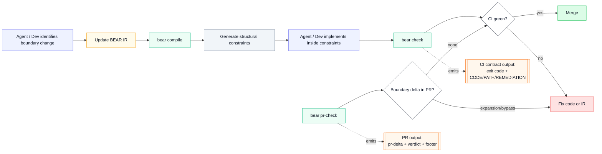

# BEAR

Block Enforceable Architectural Representation

<p align="center">
  
</p>

Agents can generate large amounts of code very quickly.
The dangerous changes are often structural: new dependencies, widened boundaries, and new authority surfaces.

BEAR is a deterministic governance CLI and CI gate that makes those structural changes explicit and visible in CI.

Demo repo: [bear-account-demo](https://github.com/rore/bear-account-demo)

## How BEAR works (10 seconds)

1. The agent updates BEAR IR when boundary authority must change.
2. `bear compile` materializes deterministic structural constraints from that IR.
3. The agent implements code inside those constraints.
4. `check` and `pr-check` surface drift, bypass, and boundary expansion in CI.

## Example governance signal

```text
BEAR Decision: REVIEW REQUIRED
MODE=observe DECISION=review-required BASE=<target-base>

CHECK exit=0 code=- classes=[CI_NO_STRUCTURAL_CHANGE]
PR-CHECK exit=5 code=BOUNDARY_EXPANSION classes=[CI_BOUNDARY_EXPANSION]
```

<p><sub>Figure: the BEAR workflow (compile -> check -> pr-check) and the outputs CI should consume.<br/>Legend: yellow = IR you edit, green = BEAR commands, orange = what automation parses.</sub></p>

## What BEAR does (plain terms)

- When boundary authority must change, the agent updates a small YAML IR contract (BEAR IR) first.
- A block is a governed backend unit; its operations, allowed effects, and ports are declared in BEAR IR.
- BEAR compiles that declaration into deterministic guardrails (wrappers, ports, manifests).
- The agent then implements code inside those guardrails instead of inventing the boundary shape ad hoc.
- Blocks interact only through declared ports; cross-boundary access outside a declared port is flagged as a violation (or PR signal).
- CI gets deterministic governance signals from `check` and `pr-check`.

## What you get

- Boundary power expansion becomes explicit and machine-parseable in PRs.
- Generated guardrails cannot drift silently.
- Every non-zero failure is actionable: `CODE`, `PATH`, `REMEDIATION`.

BEAR = Block Enforceable Architectural Representation.

<p align="center">
  
</p>

## What BEAR is not (preview non-goals)

- Not a business-rules engine.
- Not a runtime transaction framework.
- Not an agent orchestrator.
- Not a verifier of domain correctness beyond declared contract checks.
- Not a replacement for application test strategy.

## Quickstart

Prerequisites:

- clone the companion demo repo so it sits next to this repo as `../bear-account-demo`
- vendored CLI exists at `.bear/tools/bear-cli`
- canonical `--all` success path requires `bear.blocks.yaml`

Example sibling layout:

```text
<parent>/bear-cli
<parent>/bear-account-demo
```

1. Open the demo repo.

```powershell
Set-Location ..\bear-account-demo
```

2. Verify vendored CLI (not PATH).

Windows (PowerShell):

```powershell
.\.bear\tools\bear-cli\bin\bear.bat --help
```

macOS/Linux (bash/zsh):

```sh
./.bear/tools/bear-cli/bin/bear --help
```

3. Let your agent update IR first if boundary authority changes, then implement the specs inside the generated constraints.

```text
Implement the specs. Update BEAR IR first if the boundary must change.
```

4. Compile deterministic generated artifacts.

```powershell
.\.bear\tools\bear-cli\bin\bear.bat compile --all --project .
```

5. Run the deterministic enforcement gate.

```powershell
.\.bear\tools\bear-cli\bin\bear.bat check --all --project .
```

6. Run the PR governance gate.

Local sanity (base is self):

```powershell
.\.bear\tools\bear-cli\bin\bear.bat pr-check --all --project . --base HEAD
```

In a real PR/CI flow, set `--base` to the target branch or merge-base target.

## See The Live Demo

The companion demo repo shows BEAR in the actual review flow, not only as local commands:

- Demo repo: [bear-account-demo](https://github.com/rore/bear-account-demo)
- Demo guide: [docs/public/DEMO.md](docs/public/DEMO.md)

The demo currently showcases three PR outcomes:

- greenfield baseline review -> `REVIEW REQUIRED`
- ordinary feature extension -> `PASS`
- intentional expansion on existing code -> `REVIEW REQUIRED`

## Links

- Start here: [docs/public/INDEX.md](docs/public/INDEX.md)
- Quickstart: [docs/public/QUICKSTART.md](docs/public/QUICKSTART.md)
- Demo walkthrough: [docs/public/DEMO.md](docs/public/DEMO.md)
- PR/CI review: [docs/public/PR_REVIEW.md](docs/public/PR_REVIEW.md)
- Guarantees and non-goals: [docs/public/ENFORCEMENT.md](docs/public/ENFORCEMENT.md)
- Automation/reference contracts: [docs/public/CONTRACTS.md](docs/public/CONTRACTS.md)

## Supported targets

- JVM/Java target in Preview.
- Primary containment enforcement path is Java plus Gradle wrapper when `impl.allowedDeps` is declared.

Future targets (parked, not yet committed):
- Node/TypeScript backend (`node-ts-pnpm-single-package-v1`) — see `roadmap/ideas/future-node-containment-profile.md`
- .NET/C# (`dotnet-csharp-sdk-single-project-v1`) — see `roadmap/ideas/future-dotnet-containment-profile.md`
- Python (`python-pyproject-single-package-v1`) — see `roadmap/ideas/future-python-containment-profile.md`
- React/TypeScript frontend (`react-ts-vite-pnpm-single-package-v1`) — see `roadmap/ideas/future-react-containment-profile.md`

The CLI has a deterministic `Target` seam. New targets extend through that seam without changing
the core governance contracts.

This project uses [Minimap](https://github.com/rore/minimap) for repo-local roadmap and feature planning.


