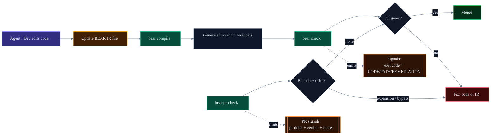

# BEAR (bear-cli)

<p align="center">
  
</p>

BEAR is a deterministic governance CLI for agentic backend development.



- as agents write more backend code, we may need strict, deterministic enforcement to prevent silent boundary expansion and generated-artifact drift
- governance should not depend on agent reasoning quality; it should show up as explicit PR/CI signals

## What BEAR does (plain terms)

- An agent updates code and (when needed) a small YAML IR contract.
- BEAR generates deterministic guardrails (wrappers/ports) from that declaration.
- Implementation can evolve freely inside those guardrails.
- CI gets deterministic governance signals from `check` and `pr-check`.

## What you get

- Boundary power expansion becomes explicit and machine-parseable in PRs.
- Generated guardrails cannot drift silently.
- Every non-zero failure is actionable: `CODE`, `PATH`, `REMEDIATION`.

## What BEAR is not (preview non-goals)

- Not a business-rules engine.
- Not a runtime transaction framework.
- Not an agent orchestrator.
- Not a verifier of domain correctness beyond declared contract checks.
- Not a replacement for application test strategy.

## Quickstart

Prerequisites:

- demo repo is present at `../bear-account-demo`
- vendored CLI exists at `.bear/tools/bear-cli`
- canonical `--all` success path requires `bear.blocks.yaml`

1. Open the demo repo.

```powershell
Set-Location ..\bear-account-demo
```

2. Verify vendored CLI (not PATH).

Windows (PowerShell):

```powershell
.\.bear\tools\bear-cli\bin\bear.bat --help
```

macOS/Linux (bash/zsh):

```sh
./.bear/tools/bear-cli/bin/bear --help
```

3. Let your agent implement specs.

```text
Implement the specs.
```

4. Run the deterministic enforcement gate.

```powershell
.\.bear\tools\bear-cli\bin\bear.bat check --all --project .
```

5. Run the PR governance gate.

Local sanity (base is self):

```powershell
.\.bear\tools\bear-cli\bin\bear.bat pr-check --all --project . --base HEAD
```

In a real PR/CI flow, set `--base` to the merge-base target (for example `origin/main`).

## Links

- Start here: [docs/public/INDEX.md](docs/public/INDEX.md)
- Quickstart: [docs/public/QUICKSTART.md](docs/public/QUICKSTART.md)
- PR/CI review: [docs/public/PR_REVIEW.md](docs/public/PR_REVIEW.md)
- Guarantees and non-goals: [docs/public/ENFORCEMENT.md](docs/public/ENFORCEMENT.md)
- Automation/reference contracts: [docs/public/CONTRACTS.md](docs/public/CONTRACTS.md)

## Supported targets

- JVM/Java target in Preview.
- Primary containment enforcement path is Java plus Gradle wrapper when `impl.allowedDeps` is declared.


