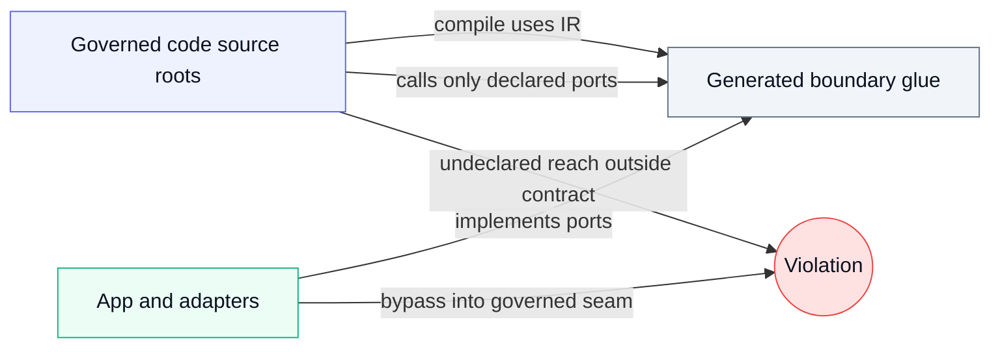

# PR / CI Review Guide

BEAR is designed so humans can review agent changes via deterministic signals, without needing to understand every implementation detail.
This page covers the PR/CI review half of the model. The local agent-loop half is: update IR when boundary authority changes, compile constraints, implement inside them, and run `check` before asking humans to review anything.


Most PR findings become obvious once you know which "zone" a path belongs to.



<p><sub>Figure: what BEAR governs vs what sits outside, and the two common failure shapes (undeclared reach, bypass into governed code).<br/>Legend: indigo = governed roots, slate = generated boundary glue, green = adapters, red = a violation.</sub></p>

In a PR or CI job, the canonical raw gate pair is:

```text
bear check --all --project <repoRoot>
bear pr-check --all --project <repoRoot> --base <ref>
```

`check` answers: "is the repo consistent with the declared boundary and generated artifacts, and do tests pass?"

`pr-check` answers: "did the declared boundary expand compared to base?"

When a downstream repo uses the packaged wrapper (`.bear/ci/bear-gates.*`), CI adds a compact review layer:
- `BEAR Decision: PASS|REVIEW REQUIRED|FAIL|ALLOWED EXPANSION`
- `MODE=<enforce|observe> DECISION=<pass|review-required|fail|allowed-expansion> BASE=<sha>`
- `CHECK exit=<code> code=<CODE|-> classes=<...>`
- `PR-CHECK exit=<code> code=<CODE|-> classes=<...>` or `PR-CHECK NOT_RUN: <reason>`
- on enforce-mode boundary expansion with usable telemetry, `ALLOW_ENTRY_CANDIDATE:` plus the exact JSON entry to copy into `.bear/ci/baseline-allow.json`
- in `observe`, boundary expansion is surfaced as `DECISION=review-required` so review-needed governance does not look like a clean pass
- the same facts are also written to `build/bear/ci/bear-ci-summary.md` for GitHub check and PR review surfaces

## What The Demo PRs Show

The companion demo repo is the easiest place to see these review states in GitHub:

- demo repo: [bear-account-demo](https://github.com/rore/bear-account-demo)
- demo guide: [DEMO.md](DEMO.md)

The showcase PRs intentionally demonstrate three different review outcomes:

- greenfield baseline review -> `REVIEW REQUIRED`
- ordinary feature extension -> `PASS`
- intentional expansion on existing code -> `REVIEW REQUIRED`

That is the intended review split: BEAR stays quiet on ordinary governed evolution and becomes visible only when governance review or real failure is needed.

## How to interpret `pr-check`

### `exit 0`: no boundary expansion detected
You should still review implementation as usual, but BEAR is not warning about increased boundary authority.

### `exit 5`: boundary expansion detected
This means the IR delta widened boundary authority (for example, new effect ports/ops, new operation entrypoints, new/relaxed invariants, idempotency usage changes).

You will see `pr-delta:` lines, then a boundary verdict:

```text
pr-delta: BOUNDARY_EXPANDING: ...
pr-check: FAIL: BOUNDARY_EXPANSION_DETECTED
CODE=BOUNDARY_EXPANSION
PATH=<ir-file>
REMEDIATION=Review boundary-expanding deltas and route through explicit boundary review.
```

Action:
- treat it as an explicit governance event
- accept (with intent) or revert
- if your CI wrapper printed `ALLOW_ENTRY_CANDIDATE:`, copy that exact entry into `.bear/ci/baseline-allow.json` only after review approval

In wrapper `observe` mode, this should normally surface to reviewers as `REVIEW REQUIRED`, not as a clean pass and not as a blocking failure.

### `exit 7`: boundary bypass detected
This is not "a policy disagreement"; it is a structural bypass signal.

Example bypass line:

```text
pr-check: BOUNDARY_BYPASS: RULE=PORT_IMPL_OUTSIDE_GOVERNED_ROOT: <relative/path>: KIND=PORT_IMPL_OUTSIDE_GOVERNED_ROOT: <interfaceFqcn> -> <implClassFqcn>
```

Action:
- fix the code shape (move/split adapters, remove forbidden seams)

## Where the details live

- Exact output shapes and ordering guarantees: [output-format.md](output-format.md)
- Exit code registry: [exit-codes.md](exit-codes.md)
- Full `pr-check` contract: [commands-pr-check.md](commands-pr-check.md)
- Downstream wrapper/report contract: [CI_INTEGRATION.md](CI_INTEGRATION.md)
- Governance policy (normative, maintainer doc): [docs/context/governance.md](../context/governance.md)

