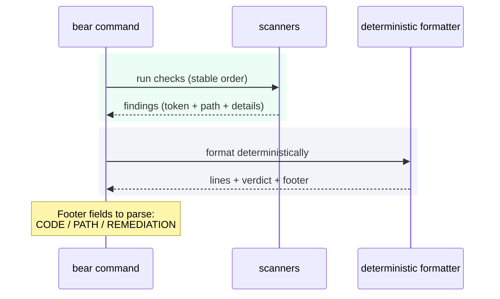

# Output Format

## Non-zero failure footer

Every non-zero exit in `validate`, `compile`, `fix`, `check`, `unblock`, and `pr-check` must end with:

```text
CODE=<enum>
PATH=<locator>
REMEDIATION=<deterministic-step>
```

Automation should treat BEAR output as a deterministic pipeline: scanners produce findings, the CLI orders and formats them, and the footer is the stable machine hook.


<p><sub>Figure: how findings become stable lines + a footer contract.</sub></p>

- Locator may be repo-relative path or stable pseudo-path token.
- Absolute filesystem paths are not allowed.
- Path separators are normalized (`/`).

## Delta and diagnostic line formats

`check` drift lines:

- `drift: ADDED: <relative/path>`
- `drift: REMOVED: <relative/path>`
- `drift: CHANGED: <relative/path>`
- `drift: MISSING_BASELINE: build/generated/bear (...)`
- wiring examples (canonical path form):
  - `drift: CHANGED: build/generated/bear/wiring/<block>.wiring.json`
  - `drift: MISSING_BASELINE: build/generated/bear/wiring/<block>.wiring.json`

`pr-check` delta lines:

- `pr-delta: <CLASS>: <CATEGORY>: <CHANGE>: <KEY>`
- shared-policy key form:
  - `<projectRoot>:_shared:<groupId:artifactId>@<version>`
  - changed version form: `@<old>-><new>`

`pr-check` boundary-bypass lines:

- `pr-check: BOUNDARY_BYPASS: RULE=PORT_IMPL_OUTSIDE_GOVERNED_ROOT: <relative/path>: KIND=PORT_IMPL_OUTSIDE_GOVERNED_ROOT: <interfaceFqcn> -> <implClassFqcn>`
- `pr-check: BOUNDARY_BYPASS: RULE=BLOCK_PORT_IMPL_INVALID: <relative/path>: BLOCK_PORT_IMPL_INVALID: block-port interface must not be implemented in src/main/java; only generated client allowed`
- `pr-check: BOUNDARY_BYPASS: RULE=BLOCK_PORT_REFERENCE_FORBIDDEN: <relative/path>: BLOCK_PORT_REFERENCE_FORBIDDEN: <detail>`
- `pr-check: BOUNDARY_BYPASS: RULE=BLOCK_PORT_INBOUND_EXECUTE_FORBIDDEN: <relative/path>: BLOCK_PORT_REFERENCE_FORBIDDEN: app wiring may not directly execute inbound target wrapper: <wrapperFqcn>.execute(...)`
- `pr-check: BOUNDARY_BYPASS: RULE=MULTI_BLOCK_PORT_IMPL_FORBIDDEN: <relative/path>: KIND=MULTI_BLOCK_PORT_IMPL_FORBIDDEN: <implClassFqcn> -> <sortedGeneratedPackageCsv>`
- `pr-check: BOUNDARY_BYPASS: RULE=MULTI_BLOCK_PORT_IMPL_FORBIDDEN: <relative/path>: KIND=MARKER_MISUSED_OUTSIDE_SHARED: <implClassFqcn>`

`pr-check` governance signal lines (informational):

- `pr-check: GOVERNANCE: MULTI_BLOCK_PORT_IMPL_ALLOWED: <relative/path>: <implClassFqcn> -> <sortedGeneratedPackageCsv>`

Generated structural evidence lines (project-test output):

- `BEAR_STRUCTURAL_SIGNAL|blockKey=<blockKey>|test=<Direction|Reach>|kind=<KIND>|detail=<detail>`
- key order is fixed and contains no spaces.
- `detail` is single-line deterministic text with stable custom formatting (no default JVM reflection `toString()` output).

`pr-check --all` repo-level shared-policy section:

- `REPO DELTA:`
- `  pr-delta: ...`
- placement: after block sections, before `SUMMARY:`

Common `check` policy lines:

- `check: HYGIENE_UNEXPECTED_PATHS: <relative/path>`
- `check: UNDECLARED_REACH: <relative/path>: <surface>`
- `check: UNDECLARED_REACH: <relative/path>: REACH_HYGIENE: KIND=REFLECTION_DISPATCH token=<token>`
- `check: BOUNDARY_BYPASS: RULE=<rule>: <relative/path>: <detail>`
- `check: INFO: CONTAINMENT_SURFACES_SKIPPED_FOR_SELECTION: projectRoot=<root>: reason=no_selected_blocks_with_impl_allowedDeps`

## Ordering guarantees

`check` single mode order:

1. baseline manifest diagnostics
2. boundary signal lines
3. drift lines
4. containment lines (including informational containment-skip line when applicable)
5. strict-hygiene lines (if enabled)
6. undeclared-reach lines
7. boundary-bypass lines
8. test failure or timeout output
9. failure footer

`pr-check` delta lines are deterministically sorted by class, category, change, and key.
`pr-check` port-impl containment findings are deterministically sorted by `path`, then `rule`, then `detail`.
for block-port enforcement, inbound wrapper deny-set derivation is deterministic and index-driven (`kind=block` edges sorted by target block key + op).
`pr-check --all` `REPO DELTA:` lines are deterministically sorted lexicographically and rendered once per repo aggregation.
`BEAR_STRUCTURAL_SIGNAL` lines are sorted within each generated structural test class; consumers must treat inter-test ordering as non-contractual.

Wiring drift diagnostics:
- one line per `(reason, path)` for wiring files (no duplicate path variants).
- wiring-detail reason rank is frozen as:
  1. `MISSING_BASELINE`
  2. `REMOVED`
  3. `CHANGED`
  4. `ADDED`

`check --all` block section note:
- for `PASS` blocks, `DETAIL:` is emitted only when non-blank contextual detail is present.


## Agent JSON mode (`--agent`)

Machine contract:

- stdout is JSON-only (`schemaVersion=bear.nextAction.v1`).
- BEAR emits no normal prose lines to stderr on normal command completion paths.
- underlying tools may still emit raw stderr.

Top-level JSON fields (v1):

- `schemaVersion`, `command`, `mode`, `collectMode`, `status`, `exitCode`
- `truncated`, `maxViolations`, `suppressedViolations`
- `problems[]`, `clusters[]`, `nextAction|null`, `extensions`

Problem fields:

- `id`, `category`, `failureCode`, `ruleId|null`, `reasonKey|null`, `severity`
- `blockId|null`, `file|null`, `span|null`
- `messageKey`, `message`, `evidence` (object)

Cluster fields:

- `clusterId`, `category`, `failureCode`, `ruleId|null`, `reasonKey|null`, `blockId|null`
- `count`, `files[]`, `filesTruncated`, `summary`

`nextAction` fields:

- `kind`, `primaryClusterId`, `title`, `steps[]`, `commands[]`, `links[]`

`extensions` fields:

- top-level `extensions` object is always present.
- for non-`pr-check` commands, and for `pr-check` paths where telemetry is unavailable, `extensions` is `{}`.
- when telemetry is available for `pr-check` or `pr-check --all`, `extensions.prGovernance` is present.

`extensions.prGovernance` fields (`schemaVersion=bear.pr-governance.v1`):

- `scope` is `single` or `all`.
- `hasDeltas`, `hasBoundaryExpansion`, `classifications[]`, `deltas[]`, `governanceSignals[]` are always present when `prGovernance` is present.
- all-mode also adds `blocks[]`.
- top-level all-mode `hasDeltas`, `hasBoundaryExpansion`, and `classifications[]` aggregate repo-level plus per-block evidence.
- top-level all-mode `deltas[]` remains repo-level only; per-block deltas live under `blocks[]`.
- `classifications[]` uses fixed canonical class order, not lexical order.
- each delta entry has `class`, `category`, `change`, `key`, `deltaId` where `deltaId=<class>|<category>|<change>|<key>`.
- each governance signal entry has `type`, `path`, and `details`.
- `details` keys are emitted in deterministic lexicographic order.

### Deterministic ordering and truncation

Ordering guarantees for arrays:

1. `problems[]`: existing exit-rank logic for the command, then `severity`, `category`, `failureCode`, `ruleId|reasonKey`, `blockId`, `file`, `span`.
2. `clusters[]`: canonical cluster order derived from ordered problems.
3. `cluster.files[]`: lexicographic, capped to first 50 (`filesTruncated=true` when capped).
4. when present, `extensions.prGovernance.classifications[]` uses fixed canonical class order; `deltas[]` sort by class, category, change, key; `blocks[]` sort by block name ascending; and `governanceSignals[].details` keys sort lexicographically.

Truncation (`MAX_VIOLATIONS=200`):

1. Primary cluster is selected before truncation.
2. Primary cluster representative always survives.
3. Selection is breadth-preserving (one representative per cluster first, then deterministic round-robin).
4. `suppressedViolations` is deterministic.

### Template lookup and fallback

`nextAction` template resolution is deterministic:

1. exact key: `(category, failureCode, ruleId|reasonKey)`
2. failure default: `(category, failureCode, *)`
3. category fallback: `GOVERNANCE` or `INFRA` safe fallback

Known exact infra mappings in v1:

- `INFRA|IO_ERROR|PROJECT_TEST_LOCK` -> clear blocked marker via `bear unblock`, rerun.
- `INFRA|IO_ERROR|PROJECT_TEST_BOOTSTRAP` -> unblock/bootstrap recovery, rerun.
- `INFRA|IO_GIT|MERGE_BASE_FAILED` -> capture base-resolution diagnostics, rerun, escalate if persistent.
- `INFRA|IO_GIT|NOT_A_GIT_REPO` -> run from a git work tree, rerun.
- `INFRA|IO_ERROR|READ_HEAD_FAILED` -> capture head IR read diagnostics, rerun, escalate if persistent.
## Related

- [exit-codes.md](exit-codes.md)
- [commands-check.md](commands-check.md)
- [commands-unblock.md](commands-unblock.md)
- [commands-pr-check.md](commands-pr-check.md)
- [commands-validate.md](commands-validate.md)
- [troubleshooting.md](troubleshooting.md)


